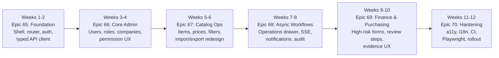

# Backoffice Frontend Redesign & Hardening Program

**Status:** Active program plan — Epic 65 complete; Epics 66–70 queued. Implementation of each queued backoffice epic requires explicit scope-freeze approval.
**Program Span:** 12 weeks (6 epics × 2 weeks each)
**Squad:** 2 frontend engineers, 1 designer (part-time), 1 QA/shared automation engineer
**Source:** `docs/frontend-research.md`
**Epic Range:** Epic 65 – Epic 70
**Epic Index File:** `_bmad-output/planning-artifacts/epics.md`

---

## Program Statement

The Backoffice Frontend Redesign & Hardening Program is an **incremental, domain-driven** consolidation of the existing Jurnapod backoffice React/Mantine UI. It is **not** a greenfield rewrite. The program builds on the existing `apps/backoffice` foundation (React 18, Vite 5, Mantine 7, TanStack Table, Dexie, Playwright, axe-core) and moves the codebase toward a **coherent, role-aware admin product** with mature data routing, typed API contracts, server-state caching, reusable data-grid primitives, staged workflow patterns, async job monitoring, audit/ops surfaces, finance-grade form UX, and a11y/i18n/CI hardening.

**Key design constraint:** The backoffice is deployed as a **static SPA** behind Nginx (confirmed in repo deployment model). All architecture decisions MUST align with this constraint. SSR is NOT in scope.

---

## Scope Freeze Compliance

The current `Temporary Scope Freeze (Architecture-First)` policy (documented in `AGENTS.md` and `project-context.md`) states:

> **`apps/backoffice` — frozen except emergency / regulatory / security fixes explicitly approved**

**EPIC 65 IS COMPLETE. EPICS 66–70 REMAIN PLANNING-ONLY.** They MUST NOT be executed until:
1. The scope freeze is explicitly lifted for the specific backoffice epic, OR
2. An explicit emergency/regulatory/security exception is approved for a specific epic.

This program plan remains the current coordination artifact. Epic 66–70 charters are queued artifacts awaiting per-epic unfreeze authorization.

---

## Program Invariants

1. **Accounting/GL at center** — All business documents reconcile to journal effects. Frontend MUST NOT introduce display-level mutations that bypass journal truth.
2. **Tenant isolation** — Every list, form, and action MUST scope by `company_id` and `outlet_id`. The shell MUST show company/outlet context at all times.
3. **ACL resource permissions** — All route guards, navigation items, and mutation buttons MUST use `module.resource` format. Deny-by-default enforced at the backend; frontend mirror is for UX only.
4. **Deny-by-default** — Navigation and mutation affordances MUST be hidden/disabled when the authenticated user lacks the required permission. Backend remains authoritative.
5. **No POS/offline invariant regression** — Backoffice changes MUST NOT alter POS offline-first behavior, `client_tx_id` idempotency, or Dexie-based offline caches used by POS.
6. **No net-new backend feature assumptions** — Frontend epics MUST assume existing API endpoints as-is. Any endpoint gap MUST be flagged as a backend dependency, not assumed to exist.
7. **Immutable finalized records** — Frontend MUST use VOID/REFUND patterns for corrections, not silent mutation.
8. **Epoch milliseconds canonical** — All business timestamps in frontend logic MUST use epoch ms. Conversion to/from ISO strings occurs only at API boundaries.

---

## Program Architecture

### Recommended Folder Architecture (from `docs/frontend-research.md`)

```
apps/backoffice/src/
  app/
    shell/          # Role-aware shell, company/outlet context, navigation
    providers/      # QueryClient, auth, locale, theme providers
    router/         # React Router route tree, guards, lazy loading
    theme/          # Mantine theme overrides, custom tokens
  routes/           # Page-level route components (lazy-loaded)
    auth/           # Login, logout, session recovery
    admin/          # Users, roles, companies, outlets, audit
    inventory/      # Items, prices, stock movements
    purchasing/     # Suppliers, POs, receipts, AP invoices, credits, payments
    accounting/     # Journals, accounts, fiscal periods, reports
    sales/          # Sales orders, invoices, customers
    settings/       # Module config, tax rates, feature toggles
  features/         # Domain feature modules (vertical slices)
    users/          # User CRUD, role assignment
    roles/          # Role presets, permission matrix
    outlets/        # Outlet management, scoping
    items/          # Item catalog, pricing
    prices/         # Price overrides, bulk pricing
    imports/        # Import workflow (upload → map → validate → apply)
    exports/        # Export workflow (scope → job → download)
    operations/     # Async job monitoring
    audit/          # Audit log explorer
  components/       # Shared UI primitives
    data-grid/      # EntityTable, FilterBar, ColumnChooser, DetailDrawer
    forms/          # ReviewPanel, staged wizard, autosave, unsaved-changes guard
    navigation/     # Navbar, breadcrumbs, outlet switcher, scope badge
    feedback/       # Notification center, toast, blocking banner
    permissions/    # PermissionMatrix, RolePresetCard, ScopeBadge
  lib/
    api/            # Typed API client, generated from OpenAPI
    auth/           # Token management, session model
    cache/          # TanStack Query config, Dexie bridge where needed
    i18n/           # Locale provider, string externalization, date/number formatters
    utils/          # Formatting, validation, permission helpers
  __test__/
    unit/           # Unit/component logic tests
    integration/    # Browser/component integration tests that are not e2e
  e2e/              # Playwright e2e tests
```

### Recommended Custom Admin Primitives

| Primitive | Purpose | First Appears |
|-----------|---------|---------------|
| `EntityTable` | Server-driven data grid with filter/sort/pagination/selection | Epic 65 |
| `FilterBar` | Sticky filter bar with saved views, column visibility | Epic 65 |
| `DetailDrawer` | Quick inspection panel without full navigation | Epic 65 |
| `ReviewPanel` | Staged form with section summary, before/after diff | Epic 69 |
| `AsyncJobDrawer` | Job lifecycle: submit → track SSE → complete → download | Epic 68 |
| `PermissionMatrix` | Module × Resource × Permission grid editor | Epic 66 |
| `AuditTimeline` | Entity-scoped change history with diffs | Epic 68 |
| `ScopeBadge` | Company/outlet/status visual badge | Epic 65 |

---

## Epic Sequence

| # | Epic | Title | Timebox | Primary Modules | Predecessor |
|---|------|-------|---------|-----------------|-------------|
| 65 | EP65 | Foundation — Shell, Router, Auth, Typed API Client, Data Grid Primitives | Weeks 1–2 | `apps/backoffice`, `packages/shared` | Complete |
| 66 | EP66 | Core Admin — Users, Roles, Companies, Permissions UX | Weeks 3–4 | `apps/backoffice`, `packages/auth`, `packages/modules/platform` | Epic 65 complete; explicit Epic 66 unfreeze required |
| 67 | EP67 | Catalog Operations — Items, Prices, Import/Export Redesign | Weeks 5–6 | `apps/backoffice`, `packages/modules/inventory` | Epic 65 |
| 68 | EP68 | Async Workflows — Operations, SSE, Notifications, Audit | Weeks 7–8 | `apps/backoffice`, `packages/shared` | Epic 65 |
| 69 | EP69 | Finance & Purchasing — High-Risk Forms, Review Steps | Weeks 9–10 | `apps/backoffice`, `packages/modules/purchasing`, `packages/modules/accounting` | Epics 66, 67 |
| 70 | EP70 | Hardening — a11y, i18n, CI, Testing, Rollout | Weeks 11–12 | `apps/backoffice` | All prior epics |

---

## Requirements Inventory (Program-Level)

### Functional Requirements

| FR-ID | Statement | Epic(s) |
|-------|-----------|---------|
| FR-P1 | The backoffice MUST use React Router v6 with lazy-loaded route chunks | 65 |
| FR-P2 | The backoffice MUST provide a typed API client generated from the backend OpenAPI spec (or equivalent Zod contract surface) | 65 |
| FR-P3 | The backoffice shell MUST display the current company context, outlet switcher, active session user, and pending jobs count at all times | 65 |
| FR-P4 | The backoffice MUST implement silent auth token refresh with foreground re-auth for sensitive transitions | 65 |
| FR-P5 | Server-state caching (TanStack Query) MUST be used for all list/detail API fetches; Dexie MUST be preserved only for offline caches and drafts | 65 |
| FR-P6 | Navigation and mutation affordances MUST be filtered by authenticated user permissions (deny-by-default UX) | 65, 66 |
| FR-P7 | The backoffice MUST provide a user management surface with role assignment, outlet scoping, and permission preview | 66 |
| FR-P8 | The backoffice MUST provide a role management surface with role presets, permission matrix editor, and change review step | 66 |
| FR-P9 | The backoffice MUST provide a company/outlet management surface with scoping badges and ACL integration | 66 |
| FR-P10 | The backoffice MUST provide a reusable server-driven data grid (EntityTable) with filter, search, sort, pagination, column chooser, row selection, and bulk actions | 65 |
| FR-P11 | The backoffice MUST render item/pricing management as data-dense lists with default-vs-outlet-override visibility | 67 |
| FR-P12 | The import workflow MUST follow the backend's staged batch API: upload → column map → validate → apply → track job → download errors | 67 |
| FR-P13 | The export workflow MUST use the backend's async job model: scope → submit → SSE progress → download result | 67 |
| FR-P14 | The backoffice MUST provide an AsyncJobDrawer component that shows job lifecycle (queued, validating, running, partially failed, completed, downloadable) | 68 |
| FR-P15 | The backoffice MUST provide an operations/job center with filter-by-status, retry, and detail view | 68 |
| FR-P16 | The backoffice MUST provide a three-layer notification system: ephemeral toast, persistent inbox, blocking banner | 68 |
| FR-P17 | The backoffice MUST provide an audit log explorer with actor, action, date range, object scope, and detail drawer | 68 |
| FR-P18 | The backoffice MUST provide a layered dashboard pattern: Global Admin Overview, Domain Dashboard, My Work panel | 68 |
| FR-P19 | High-risk financial forms (journals, purchases, invoices, fiscal controls) MUST use a ReviewPanel with before/after diff and final confirmation step | 69 |
| FR-P20 | The backoffice MUST provide purchasing domain screens: suppliers, purchase orders, goods receipts, AP invoices, payments, credits | 69 |
| FR-P21 | The backoffice MUST provide accounting domain screens: journals, accounts, fiscal period controls, reports | 69 |
| FR-P22 | The backoffice MUST achieve WCAG 2.2 AA compliance: keyboard-operable grids, visible focus, descriptive labels, error prevention on financial changes | 70 |
| FR-P23 | The backoffice MUST support internationalization: document `lang`, externalized UI strings, locale-aware date/number/currency formatting | 70 |
| FR-P24 | The backoffice MUST have a Playwright e2e test suite covering critical admin flows across Chromium, Firefox, and WebKit | 70 |
| FR-P25 | The backoffice CI MUST include lint, typecheck, test, a11y scan, and bundle-size check gates | 70 |
| FR-P26 | The backoffice workspace MUST expose standardized test/build evidence scripts used by the program (`test:unit`, `test:single`, `build:report`) before epic validation commands rely on them | 65, 70 |
| FR-P27 | The program MUST explicitly defer sales, dine-in, customer admin, and POS support domain screens to a future approved program | 65–70 |

### Non-Functional Requirements

| NFR-ID | Statement | Validation |
|--------|-----------|------------|
| NFR-P1 | No regression in POS offline-first or `client_tx_id` idempotency | POS e2e suite passes |
| NFR-P2 | No change to backend API authoritative permission enforcement | Existing ACL integration tests pass |
| NFR-P3 | Frontend route-level permissions are a UX mirror only; backend MUST remain authoritative for enforcement | Code audit |
| NFR-P4 | All API calls MUST use the typed client; raw `fetch`/`axios` bypasses MUST NOT appear in domain code | Lint gate |
| NFR-P5 | Bundle size MUST NOT increase by more than 30% over baseline | Vite build analysis |
| NFR-P6 | Lazy-loaded route chunks MUST be used; no monolithic bundle | Vite chunk audit |
| NFR-P7 | Every component MUST have proper loading, empty, and error states | Storybook / visual audit (or manual) |
| NFR-P8 | All new components MUST have Vitest unit tests; data-grid and form primitives MUST have Playwright CT tests | CI gate |
| NFR-P9 | All new feature modules MUST have Playwright e2e coverage for happy path and permission-denied paths | CI gate |
| NFR-P10 | CSP headers MUST be applied in development and production configurations | Header inspection |
| NFR-P11 | Audit-logged actions MUST be deep-linkable from the notification center | Manual verification |
| NFR-P12 | The backoffice MUST NOT introduce new business-logic DB triggers | `npm run lint:migrations` passes |

---

## Dependency Map

```
Epic 65 (Foundation)
  ├── Epic 66 (Core Admin)       — depends on: typed API client, shell, auth, router
  ├── Epic 67 (Catalog Ops)      — depends on: typed API client, shell, auth, router
  ├── Epic 68 (Async Workflows)  — depends on: shell, auth, router
  ├── Epic 69 (Finance/Purch.)   — depends on: Epic 66 (permissions), Epic 67 (catalog workflow patterns), Epic 65 (data-grid)
  └── Epic 70 (Hardening)        — depends on: ALL prior epics
```

Epics 66, 67, and 68 MAY run concurrently after Epic 65 completion only because Epic 65 owns the shared `EntityTable`, `FilterBar`, `DetailDrawer`, `ScopeBadge`, route, auth, and typed-client foundations. Domain epics MUST consume those shared primitives and MUST NOT create inline duplicate table/drawer/filter implementations. Epic 69 MUST wait for Epic 66 (permission-aware shell must exist for financial access control) and Epic 67 (catalog workflow patterns). Epic 70 MUST be last.

---

## Risk Register

| Risk ID | Severity | Description | Mitigation |
|---------|----------|-------------|------------|
| R-PGM-01 | P0 | Backoffice unfreeze not approved before execution starts | Program remains queued; do not start without explicit authorization |
| R-PGM-02 | P0 | Backend API contract gaps discovered mid-epic (missing endpoint, wrong response shape) | Flag as backend dependency in story notes; do not assume endpoint exists |
| R-PGM-03 | P1 | Typed API client generation from OpenAPI may be incomplete or inaccurate | Build client generation as a separate story with validation against actual endpoint responses |
| R-PGM-04 | P1 | Team does not have React Router + TanStack Query expertise | Include spike/exploration story in Epic 65 Foundation |
| R-PGM-05 | P1 | Migrating from hand-rolled hash router to mature router breaks existing deep links | Map all existing deep links and provide redirect map; test in e2e suite |
| R-PGM-06 | P2 | Dexie usage reduction may uncover stale cached data assumptions in existing pages | Keep Dexie for reference data; migrate only list/detail fetches to TanStack Query |
| R-PGM-07 | P2 | WCAG 2.2 AA compliance may require Mantine component overrides or replacements | Document in Epic 70; budget for custom accessible component workarounds |
| R-PGM-08 | P2 | i18n effort may exceed 1 sprint if locale pack coverage is broad | Prioritise English + Indonesian MVP; defer additional locales to follow-up |
| R-PGM-09 | P2 | Bundle size may exceed threshold from Mantine + TanStack Query + React Router | Vite chunk analysis at Epic 65 midpoint; trim unused Mantine imports |
| R-PGM-10 | P3 | Playwright e2e suite may be flaky on Firefox/WebKit | Use Playwright's built-in retry mechanism; pin browser versions |

---

## SOLID/DRY/KISS Gates

Per the `Sprint-48-61-Correctness-First-Architecture-Blueprint` (extended by precedent), each epic in this program MUST apply the SOLID/DRY/KISS checklist at kickoff, midpoint, and pre-close:

1. **Kickoff Gate** — Score `Unknown/Pass/Fail` before first story starts
2. **Mid-Sprint Checkpoint** — Re-score and escalate unresolved P1 risks
3. **Pre-Close Quality Gate** — Attach evidence and run adversarial review gate

---

## Cross-Cutting Concerns

### Permission Testing (MANDATORY)

All negative authorization tests (expected 401/403) MUST use `CASHIER` or dedicated low-privilege test roles, NOT `OWNER`/`SUPER_ADMIN`. This applies to Playwright e2e assertions that validate backend-enforced access control.

### Fixture Flow (Backoffice Tests)

Integration tests for backoffice domain logic (if any) MUST follow the Full Fixture Mode policy: use canonical production package flow. Backoffice tests MUST NOT introduce ad-hoc SQL for setup.

### Import Path Convention

All new backoffice code MUST use `@/` alias for imports from `apps/backoffice/src/`. No relative path imports like `../../../src/`.

### Epoch Milliseconds Canonical

All business timestamps in frontend business logic MUST use epoch milliseconds (`number`). Conversion to/from ISO strings occurs only at API boundaries. The `@js-temporal/polyfill` MUST be used for date/time operations; native `Date` MUST NOT be used for business logic.

---

## Delivery Milestone Flow



---

## Program Exit Gate

All six epics MUST be complete with the following evidence:

1. **Functional Completeness:** All program-level FRs (FR-P1 through FR-P25) implemented with passing tests.
2. **Accessibility:** WCAG 2.2 AA audit passes (axe-core scan + manual spot-check).
3. **Internationalization:** English + Indonesian locale packs loaded; `lang` attribute set; locale-aware formatting confirmed.
4. **Test Coverage:** Vitest unit tests, Playwright CT tests, and Playwright e2e tests for critical admin flows all green.
5. **CI Gates:** Backoffice lint, typecheck, test, a11y scan, and bundle-size gates pass in CI.
6. **Security:** CSP headers confirmed; deny-by-default navigation verified.
7. **No Regression:** POS offline-first, `client_tx_id` idempotency, and backend ACL enforcement all unchanged.
8. **Zero Blockers:** No unresolved P0/P1 items in any epic scope.

---

## Current Execution State

| Epic | State | Evidence |
|------|-------|----------|
| 65 | Complete | `epic-65: done` in sprint status; commit `e8c6f046` |
| 66 | Backlog / planning-only | Story specs created; `epic-66: backlog`; explicit unfreeze required |
| 67 | Queued / planning-only | Explicit unfreeze required |
| 68 | Queued / planning-only | Explicit unfreeze required |
| 69 | Queued / planning-only | Explicit unfreeze required |
| 70 | Queued / planning-only | Explicit unfreeze required |

---

## Output Artifacts

| Artifact | Path |
|----------|------|
| Program Plan | `_bmad-output/planning-artifacts/backoffice-frontend-hardening-program.md` |
| Epic 65 Charter | `_bmad-output/implementation-artifacts/stories/epic-65/epic-65.md` |
| Epic 66 Charter | `_bmad-output/implementation-artifacts/stories/epic-66/epic-66.md` |
| Epic 67 Charter | `_bmad-output/implementation-artifacts/stories/epic-67/epic-67.md` |
| Epic 68 Charter | `_bmad-output/implementation-artifacts/stories/epic-68/epic-68.md` |
| Epic 69 Charter | `_bmad-output/implementation-artifacts/stories/epic-69/epic-69.md` |
| Epic 70 Charter | `_bmad-output/implementation-artifacts/stories/epic-70/epic-70.md` |
| Existing epic index | `_bmad-output/planning-artifacts/epics.md` (add: Epic 65–70 entries) |

---

## Validation Commands (Program-Level)

```bash
# Per-epic pre-flight
npm run lint -w @jurnapod/backoffice
npm run typecheck -w @jurnapod/backoffice
npm run build -w @jurnapod/backoffice

# Full validation gate
npm run lint -w @jurnapod/backoffice && \
npm run typecheck -w @jurnapod/backoffice && \
npm run test -w @jurnapod/backoffice && \
npm run qa:e2e -w @jurnapod/backoffice && \
npm run qa:e2e:axe -w @jurnapod/backoffice

# Bundle size check (script added by this program)
npm run build:report -w @jurnapod/backoffice

# Fixture flow (if API-level tests added)
npm run lint:fixture-flow -w @jurnapod/api

# Migration lint (gate against new business-logic triggers)
npm run lint:migrations

# Sprint status validation
npx tsx scripts/validate-sprint-status.ts --epic 65
npx tsx scripts/validate-sprint-status.ts --epic 66
npx tsx scripts/validate-sprint-status.ts --epic 67
npx tsx scripts/validate-sprint-status.ts --epic 68
npx tsx scripts/validate-sprint-status.ts --epic 69
npx tsx scripts/validate-sprint-status.ts --epic 70
```

---

## Existing Backoffice Baseline (as of program start)

- **Framework:** React 18 + Vite 5 + TypeScript strict
- **UI Library:** Mantine 7.x (`@mantine/core`, `@mantine/dates`, `@mantine/hooks`, `@mantine/notifications`)
- **Data Grid:** TanStack Table 8.x (present as dependency)
- **Offline:** Dexie 4.x
- **Testing:** Current package script runs the legacy Node test harness; this program MUST add standardized `test:unit` and `test:single` scripts before story-level validation relies on them. Playwright with Chromium/Firefox/WebKit and axe-core are already present.
- **CI:** Playwright e2e already in package scripts (`qa:e2e`, `qa:e2e:axe`)
- **Router:** Hand-rolled hash router (`src/app/router.tsx`, `src/app/routes.ts`)
- **Auth:** Access token in app state + refresh token via HttpOnly cookie
- **PWA:** Vite PWA plugin with Workbox runtime caching for API routes
- **State Management:** No TanStack Query yet; Dexie used for reference data caching

---

_Last Updated: 2026-05-17_
