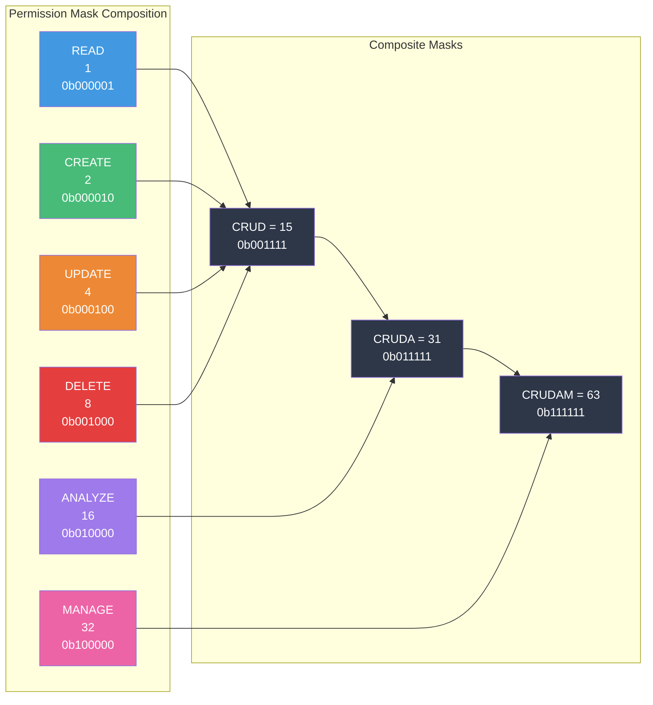
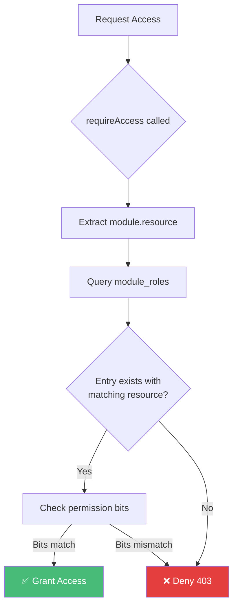

# ACL Permissions System

> **Epic 39** — Resource-Level Permission Model ✅ COMPLETE (2026-04-13)  
> **Status**: Strict resource-level enforcement active (migration 0158)  
> This document provides the canonical reference for Jurnapod's RBAC permission hierarchy.

---

## Overview

Jurnapod uses a **resource-level RBAC (Role-Based Access Control)** system with the following key characteristics:

- **7 Canonical Modules**: Core business domains
- **21 Resources**: Fine-grained entities within modules  
- **6 Permission Bits**: READ, CREATE, UPDATE, DELETE, ANALYZE, MANAGE
- **6 Role Tiers**: SUPER_ADMIN → OWNER → COMPANY_ADMIN → ADMIN → CASHIER → ACCOUNTANT

---

## Visual Hierarchy

### Module-Resource Tree

```mermaid
graph TD
    A[Jurnapod ACL System] --> B[platform]
    A --> C[accounting]
    A --> D[inventory]
    A --> E[treasury]
    A --> F[sales]
    A --> G[pos]
    A --> H[reservations]
    
    B --> B1[users]
    B --> B2[roles]
    B --> B3[companies]
    B --> B4[outlets]
    B --> B5[settings]
    
    C --> C1[journals]
    C --> C2[accounts]
    C --> C3[fiscal_years]
    C --> C4[reports]
    
    D --> D1[items]
    D --> D2[stock]
    D --> D3[costing]
    
    E --> E1[transactions]
    E --> E2[accounts]
    
    F --> F1[invoices]
    F --> F2[orders]
    F --> F3[payments]
    
    G --> G1[transactions]
    G --> G2[config]
    
    H --> H1[bookings]
    H --> H2[tables]
    
    style A fill:#2d3748,color:#fff,stroke:#1a202c,stroke-width:3px
    style B fill:#3182ce,color:#fff
    style C fill:#38a169,color:#fff
    style D fill:#d69e2e,color:#fff
    style E fill:#805ad5,color:#fff
    style F fill:#e53e3e,color:#fff
    style G fill:#319795,color:#fff
    style H fill:#dd6b20,color:#fff
```



---

## Permission Structure

### Permission Bits (CRUDAM)

| Bit | Name | Value | Binary | Description |
|-----|------|-------|--------|-------------|
| 1 | READ | 1 | `0b000001` | View data and records |
| 2 | CREATE | 2 | `0b000010` | Create new records |
| 4 | UPDATE | 4 | `0b000100` | Modify existing records |
| 8 | DELETE | 8 | `0b001000` | Remove records |
| 16 | ANALYZE | 16 | `0b010000` | Reports, dashboards, analytics |
| 32 | MANAGE | 32 | `0b100000` | Setup, configuration, admin |

### Composite Permission Masks

| Mask | Value | Binary | Permissions |
|------|-------|--------|-------------|
| READ | 1 | `0b000001` | View only |
| WRITE | 6 | `0b000110` | CREATE + UPDATE |
| CRUD | 15 | `0b001111` | READ + CREATE + UPDATE + DELETE |
| CRUDA | 31 | `0b011111` | CRUD + ANALYZE |
| CRUDAM | 63 | `0b111111` | Full permissions |

### Visual: Permission Bit Composition



---

## Resource Catalog

### Module Breakdown

| Module | Resources | Purpose |
|--------|-----------|---------|
| **platform** | users, roles, companies, outlets, settings | Organization & identity management |
| **accounting** | journals, accounts, fiscal_years, reports | Financial ledger & reporting |
| **inventory** | items, stock, costing | Inventory management |
| **treasury** | transactions, accounts | Cash/bank management |
| **sales** | invoices, orders, payments | Sales operations |
| **pos** | transactions, config | Point of sale operations |
| **reservations** | bookings, tables | Table reservations |

### Resource Permission Format

Permissions are specified using `module.resource` format:

```typescript
// Examples
"platform.users"          // User management
"accounting.journals"     // Journal entries
"inventory.items"         // Item master data
"sales.invoices"          // Sales invoicing
"pos.transactions"        // POS transactions
```

---

## Role Permission Matrix

### Summary View

| Role | platform | accounting | inventory | treasury | sales | pos | reservations |
|------|----------|------------|-----------|----------|-------|-----|--------------|
| SUPER_ADMIN | CRUDAM (63) | CRUDAM (63) | CRUDAM (63) | CRUDAM (63) | CRUDAM (63) | CRUDAM (63) | CRUDAM (63) |
| OWNER | CRUDAM* (63) | CRUDAM (63) | CRUDAM (63) | CRUDAM (63) | CRUDAM (63) | CRUDAM (63) | CRUDAM (63) |
| COMPANY_ADMIN | CRUDA** (31) | CRUDAM (63) | CRUDAM (63) | CRUDAM (63) | CRUDAM (63) | CRUDAM (63) | CRUDAM (63) |
| ADMIN | READ (1) | CRUDA (31) | CRUDA (31) | CRUDA (31) | CRUDA (31) | CRUDA (31) | CRUDA (31) |
| ACCOUNTANT | READ (1) | CRUDA (31) | READ (1) | READ (1) | READ (1) | 0 | 0 |
| CASHIER | 0 | 0 | READ (1) | READ (1) | CRUDA (31) | CRUDA (31) | CRUDA (31) |

\* OWNER: `platform.companies` = 5 (READ + UPDATE only, no CREATE/DELETE)  
\*\* COMPANY_ADMIN: `platform.roles` = 0 (no role management)

### Detailed Permission Matrix

```mermaid
%%{init: {'theme': 'base', 'themeVariables': { 'primaryColor': '#e2e8f0', 'primaryTextColor': '#1a202c', 'primaryBorderColor': '#4a5568', 'lineColor': '#4a5568', 'secondaryColor': '#f7fafc', 'tertiaryColor': '#edf2f7'}}}%%

flowchart TB
    subgraph SUPER_ADMIN["🔴 SUPER_ADMIN"]
        SA_ALL["All Modules: CRUDAM (63)"]
    end
    
    subgraph OWNER["🟠 OWNER"]
        O_PLAT["platform.companies: 5 (READ+UPDATE)"]
        O_OTHER["All other resources: CRUDAM (63)"]
    end
    
    subgraph COMPANY_ADMIN["🟡 COMPANY_ADMIN"]
        CA_PLAT["platform: users(31), outlets(31), settings(31)"]
        CA_PLAT2["platform: companies(0), roles(0)"]
        CA_OPS["accounting/inventory/treasury/sales: CRUDAM (63)"]
        CA_POS["pos/reservations: CRUDAM (63)"]
    end
    
    subgraph ADMIN["🟢 ADMIN"]
        AD_PLAT["platform: READ (1) on all"]
        AD_OPS["accounting/treasury/sales: CRUDA (31)"]
        AD_INV["inventory: CRUDA (31)"]
        AD_POS["pos/reservations: CRUDA (31)"]
    end
    
    subgraph ACCOUNTANT["🔵 ACCOUNTANT"]
        AC_PLAT["platform: READ (1)"]
        AC_ACC["accounting: CRUDA (31)"]
        AC_READ["inventory/treasury/sales: READ (1)"]
        AC_NONE["pos/reservations: 0"]
    end
    
    subgraph CASHIER["🟣 CASHIER"]
        CA_NONE["platform: 0"]
        CA_INV["inventory: READ (1)"]
        CA_TRE["treasury: READ (1)"]
        CA_SAL["sales: CRUDA (31)"]
        CA_POS2["pos/reservations: CRUDA (31)"]
    end
    
    SUPER_ADMIN --> OWNER --> COMPANY_ADMIN --> ADMIN --> ACCOUNTANT --> CASHIER
```



---

## Resource-Level Permissions (Strict Model)

### Concept

Epic 39 established a **strict resource-level permission model** where all permissions require an explicit resource. There is no module-level wildcard fallback.

| Aspect | Before (Pre-Epic 39) | After (Epic 39) |
|--------|---------------------|-----------------|
| **Format** | `module` only | `module.resource` required |
| **Granularity** | Module-level wildcard | Explicit resource only |
| **Schema** | `resource` nullable | `resource` NOT NULL (migration 0158) |
| **Fallback** | Module-level grants all resources | No fallback — explicit only |

### Permission Resolution Flow



### Strict Enforcement Rules

| Rule | Description | Validation |
|------|-------------|------------|
| **Explicit Resource Required** | All permission checks must specify `resource` | Runtime error if missing |
| **No Wildcard Fallback** | `resource=NULL` entries do NOT grant access | Schema enforced (migration 0158) |
| **Canonical Resources Only** | Resource must be from `RESOURCE_CODES` | Type checking via TypeScript |

### Example: Permission Check Flow

```typescript
// Route definition with resource-level permission
app.get('/api/inventory/items', 
  requireAccess({ 
    module: 'inventory', 
    resource: 'items',      // ← REQUIRED - explicit resource
    permission: 'READ' 
  }),
  handler
);

// Database lookup (resource is NOT NULL)
table: module_roles
┌─────────┬──────────────┬────────────┬─────────────────┐
│ user_id │    module    │  resource  │ permission_mask │
├─────────┼──────────────┼────────────┼─────────────────┤
│    101  │  inventory   │    items   │        31       │  ← CRUDA
│    101  │  inventory   │    stock   │         1       │  ← READ only
│    101  │  inventory   │   costing  │         1       │  ← READ only
└─────────┴──────────────┴────────────┴─────────────────┘

// Bit check: (31 & 1) !== 0 → ✅ Granted
```

---

## Implementation Reference

### Source Files

| File | Purpose |
|------|---------|
| `packages/shared/src/constants/rbac.ts` | Permission bits, masks, role codes |
| `packages/shared/src/constants/modules.ts` | 7 canonical module codes |
| `packages/shared/src/constants/resources.ts` | 21 resource codes |
| `packages/shared/src/constants/roles.defaults.json` | **Source of truth** for default permissions |
| `packages/modules/platform/src/companies/constants/permission-matrix.ts` | Re-export with types |

### Permission Check Code

```typescript
import { requireAccess } from '@/lib/auth-guard';
import { PERMISSION_BITS } from '@jurnapod/shared';

// Route with resource-level permission
app.post('/api/inventory/items',
  requireAccess({
    module: 'inventory',
    resource: 'items',        // ← Resource-level
    permission: 'CREATE'      // ← Checks bit 2
  }),
  createItemHandler
);

// Using permission bits directly
const canUpdate = (permissionMask & PERMISSION_BITS.UPDATE) !== 0;
```

### Database Schema

```sql
-- module_roles table stores permissions (Epic 39: resource is NOT NULL)
create table module_roles (
  id bigint unsigned auto_increment primary key,
  role_id bigint unsigned not null,
  company_id bigint unsigned not null,  -- Tenant scoping
  module varchar(50) not null,          -- 'inventory', 'sales', etc.
  resource varchar(64) not null,        -- 'items', 'invoices', etc. (MANDATORY - migration 0158)
  permission_mask int default 0,        -- Bitmask: READ=1, CREATE=2, UPDATE=4, DELETE=8, ANALYZE=16, MANAGE=32
  created_at timestamp default current_timestamp,
  updated_at timestamp default current_timestamp on update current_timestamp,
  unique key uq_module_role (company_id, role_id, module, resource)
);
```

**Schema Notes:**
- `resource` is **NOT NULL** — Migration 0158 enforces explicit resource values
- `company_id` is part of unique constraint for tenant isolation
- No wildcard entries — every permission maps to a specific `module.resource`

### Migrations Applied

| Migration | Purpose | Status |
|-----------|---------|--------|
| `0147_acl_reorganization.sql` | Add resource column | ✅ Applied |
| `0147.5_acl_data_migration.sql` | Initial data migration | ✅ Applied |
| `0148_acl_complete_resource_migration.sql` | Resource-level entries | ✅ Applied |
| `0158_acl_enforce_resource_not_null.sql` | **Enforce NOT NULL** | ✅ Applied |

---

## Canonical Permission Values

### SUPER_ADMIN / OWNER

All resources: **CRUDAM (63)**

| Resource | Mask | Note |
|----------|------|------|
| All 21 resources | 63 | Full control |

### COMPANY_ADMIN

| Module | Resource | Mask | Notes |
|--------|----------|------|-------|
| platform | users | 31 | CRUDA |
| platform | roles | 0 | No role management |
| platform | companies | 0 | No company creation |
| platform | outlets | 31 | CRUDA |
| platform | settings | 31 | CRUDA |
| * | * | 63 | All other resources: CRUDAM |

### ADMIN

| Module | Resource | Mask |
|--------|----------|------|
| platform | * | 1 | READ only |
| accounting | journals | 31 | CRUDA |
| accounting | * | 1 | READ only (except journals) |
| inventory | * | 31 | CRUDA |
| treasury | * | 31 | CRUDA |
| sales | * | 31 | CRUDA |
| pos | * | 31 | CRUDA |
| reservations | * | 31 | CRUDA |

### ACCOUNTANT

| Module | Resource | Mask |
|--------|----------|------|
| platform | * | 1 | READ only |
| accounting | journals | 31 | CRUDA |
| accounting | reports | 31 | CRUDA |
| accounting | * | 1 | READ only |
| * | * | 1/0 | READ or none |

### CASHIER

| Module | Resource | Mask |
|--------|----------|------|
| platform | outlets | 1 | READ only |
| treasury | accounts | 1 | READ only |
| inventory | items | 1 | READ only |
| sales | * | 31 | CRUDA |
| pos | * | 31 | CRUDA |
| reservations | * | 31 | CRUDA |

---

## Migration Notes

### Epic 39 Completion Status: ✅ DONE

Epic 39 ACL reorganization is **complete** with strict resource-level enforcement active.

### From Module-Level to Strict Resource-Level

| Before (Pre-Epic 39) | After (Epic 39) | Enforcement |
|---------------------|-----------------|-------------|
| `module_roles.resource = NULL` | `module_roles.resource = 'items'` | NOT NULL constraint (migration 0158) |
| `permission_mask` bits: Read=2, Create=1 | `permission_mask` bits: Read=1, Create=2 | Canonical values enforced |
| Module-level wildcard fallback | **No fallback** — explicit resource required | Runtime validation |
| 12+ inconsistent module definitions | 7 canonical modules | Shared constants enforced |

### Key Changes

1. **Permission bit values standardized**: Read=1, Create=2, Update=4, Delete=8, Analyze=16, Manage=32
2. **Strict resource enforcement**: Migration 0158 enforces `resource IS NOT NULL`
3. **No wildcard fallback**: `resource=NULL` entries do NOT grant resource-level access
4. **ANALYZE replaces REPORT**: Bit 16 renamed from REPORT to ANALYZE
5. **MANAGE added**: Bit 32 for configuration/admin access
6. **Canonical source**: `packages/shared/src/constants/roles.defaults.json` is single source of truth

### Verification

```bash
# Verify all tests pass
npm run test:integration -w @jurnapod/api

# Verify strict enforcement
npm run db:migrate -w @jurnapod/db
mysql -e "DESCRIBE module_roles;"  # resource column shows NOT NULL
```

---

## Related Documents

- `AGENTS.md` — Root agent documentation with ACL rules
- `docs/epic-39-test-failures-reference.md` — Epic 39 implementation notes
- `docs/adr/ADR-0005-layered-auth-guard-composition.md` — Auth guard architecture
