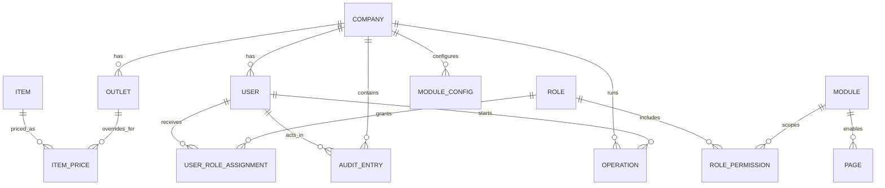
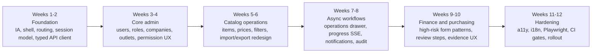

# Jurnapod Backoffice Frontend Design Research Report

## Executive summary

The strongest recommendation is **not** a greenfield rewrite. `s18id/jurnapod` already contains a live backoffice foundation built with **React 19, Vite 7, Mantine, TanStack Table/Form, Dexie, Playwright, and Vite PWA**, alongside a Hono-based API, WebSocket support, health/metrics endpoints, and a production deployment model that serves the backoffice as a static app behind Nginx. The best frontend for this project is therefore an **incremental, domain-driven React backoffice** that consolidates the existing UI into a more coherent admin product, instead of replacing the stack wholesale. fileciteturn21file0L3-L3 fileciteturn26file0L3-L3 fileciteturn27file0L3-L3 fileciteturn28file0L3-L3 fileciteturn50file0L3-L3

From the repository, the product shape is clearly **multi-company / multi-outlet, permissioned, operationally sensitive, and data-heavy**. The API surface spans auth, users, roles, companies, outlets, inventory, POS, sales, dine-in, purchasing, accounting, reports, imports, exports, sync, audit, and admin dashboards. That breadth argues for a backoffice IA centered on **role-aware navigation, high-density data lists, staged forms and wizards, job progress tracking, and auditability** rather than consumer-style navigation. fileciteturn28file0L3-L3 fileciteturn42file0L3-L3 fileciteturn29file0L3-L3 fileciteturn32file0L3-L3 fileciteturn33file0L3-L3 fileciteturn47file0L3-L3

The most important product-level design conclusion is this: **the frontend should align much more closely with the backend’s staged workflows**. The clearest example is imports. The backend already exposes purpose-built staged import endpoints (`upload`, `validate`, `apply`) and long-running operation progress APIs with SSE, but at least one existing front-end import flow still loops row-by-row against `/inventory/items`. The “best” backoffice should standardize on the backend’s batch-first workflow model for imports, exports, reconciliation tasks, and other expensive operations. fileciteturn32file0L3-L3 fileciteturn47file0L3-L3 fileciteturn34file0L3-L3 fileciteturn35file0L3-L3

My recommended stack is therefore:

- **React + TypeScript + Vite**
- **Mantine** as the primary UI/design-system layer
- A **mature data router** replacing the current hand-rolled hash-router approach
- **Typed API contracts** generated from the repo’s OpenAPI-capable backend
- **Server-state caching** for list/detail views, while preserving Dexie only where offline caching or drafts are genuinely useful
- **Role-aware shell navigation**, **server-driven data grids**, **staged wizards**, **audit/event views**, and **operations/job monitoring** as first-class primitives. fileciteturn21file0L3-L3 fileciteturn22file0L3-L3 fileciteturn23file0L3-L3 fileciteturn44file0L3-L3 fileciteturn45file0L3-L3

Where the repo is silent, I used these assumptions: evergreen desktop browsers only, static frontend deployment behind Nginx, 50–300 concurrent internal staff users, and English plus Indonesian localization as the most likely initial locale set.

## Repo-derived backend constraints and discovered endpoint families

At runtime, Jurnapod’s API is a **Node HTTP server wrapping a Hono application**, with environment validation at startup, request compression on `/api/*`, explicit CORS handling, a WebSocket server on `/ws`, Prometheus metrics, alert evaluation, and non-production Swagger routes. The production guide confirms a **Node 22 + MySQL/MariaDB + Nginx** deployment model, API on port 3001, and static deployment for the backoffice under `public_html/backoffice`. fileciteturn27file0L3-L3 fileciteturn28file0L3-L3 fileciteturn50file0L3-L3

That deployment model matters for frontend design. It means the backoffice is not being conceived as a highly server-rendered web app; it is being deployed as a **static SPA** that talks to the API across CORS-controlled origins. That strongly favors keeping a Vite-built SPA architecture and focusing effort on shell/navigation, state, data loading, permissions, and workflow UX instead of switching to SSR for its own sake. fileciteturn28file0L3-L3 fileciteturn50file0L3-L3 citeturn18view0turn19view3

The repo also shows an API designed for **operational observability**. There are health endpoints (`/api/health`, `/api/health/live`, `/api/health/ready`), metrics, admin dashboards, and progress endpoints for long-running operations. This is a signal that the backoffice should include a clear **operations surface** rather than hiding operational states in small toasts or background polling. fileciteturn31file0L3-L3 fileciteturn30file0L3-L3 fileciteturn47file0L3-L3

The following endpoint families are clearly mounted in the API application:

| Endpoint family | Examples visible in repo | Frontend implication |
|---|---|---|
| Authentication | `/api/auth/login`, `/api/auth/logout`, `/api/auth/refresh` | login shell, session renewal, sign-out, auth failure recovery |
| Identity / RBAC | `/api/users`, `/api/users/me`, `/api/roles`, module-role settings | user admin, role assignment, permission-aware navigation |
| Tenant / org | `/api/companies`, `/api/outlets` | company/outlet switcher, outlet-scoped views |
| Core business domains | inventory, recipes, supplies, POS, sales, dine-in, purchasing, accounting, accounts, journals, reports | domain modules with data-dense list/detail/form UX |
| Platform / settings | modules, pages, tax rates, config | settings console, feature toggles, page/module management |
| Job workflows | `/api/import/*`, `/api/export/*`, `/api/operations/*`, `/api/sync/*` | wizard flows, file processing, progress bars, async job center |
| Controls / evidence | `/api/audit/*`, `/admin/dashboard/*`, `/metrics`, `/ws`, `/api/health/*` | audit log UI, admin dashboards, system status, alerts |

This table is derived from route registration in `app.ts` and the route-specific files fetched from the repo. fileciteturn28file0L3-L3 fileciteturn40file0L3-L3 fileciteturn41file0L3-L3 fileciteturn42file0L3-L3 fileciteturn29file0L3-L3 fileciteturn31file0L3-L3 fileciteturn32file0L3-L3 fileciteturn33file0L3-L3 fileciteturn47file0L3-L3

A second repo-level constraint is **multi-tenancy plus outlet scoping**. Several APIs derive `companyId` from auth, user management supports outlet assignments, caches are keyed by company and outlet, and the backoffice session model includes selected outlet and permissions metadata. The UI should therefore avoid a flat “single tenant” mental model. The best shell includes a persistent **company context**, an **outlet switcher**, and explicit scoping labels on every risky list/form so users do not accidentally apply actions to the wrong outlet or company. fileciteturn42file0L3-L3 fileciteturn43file0L3-L3 fileciteturn44file0L3-L3 fileciteturn45file0L3-L3 fileciteturn23file0L3-L3

A third constraint is that the backend already models **asynchronous and resumable work**. Imports have session semantics and staged validation; exports switch to streaming for larger datasets; progress endpoints support polling and SSE; auto-sync and Dexie caches exist on the current front-end. A high-quality admin UI should lean into those primitives with explicit **job lifecycles**: queued, validating, running, partially failed, completed, downloadable result. fileciteturn32file0L3-L3 fileciteturn33file0L3-L3 fileciteturn47file0L3-L3 fileciteturn44file0L3-L3 fileciteturn46file0L3-L3

The entity relationships implied by the repo are summarized below.



The diagram reflects structures and relationships visible in the users, audit, cache, session, and route layers. fileciteturn42file0L3-L3 fileciteturn29file0L3-L3 fileciteturn44file0L3-L3 fileciteturn45file0L3-L3 fileciteturn23file0L3-L3

## User roles, workflows, required screens, and prioritized features

The repo indicates a role model that is **more than simple RBAC**. The backend uses permission checks by module/resource/action, users can be assigned outlet-scoped roles, and OWASP is correct that mature applications usually need access control richer than plain role labels alone. For Jurnapod, the correct UI model is “**role templates + scoped permissions + tenant/outlet context**,” not simply “pick one role from a dropdown.” fileciteturn42file0L3-L3 fileciteturn29file0L3-L3 fileciteturn43file0L3-L3 citeturn13view0turn13view1

The concrete user archetypes visible from the repo are best interpreted as:

- **Owner / Admin** for company-wide settings, users, roles, modules, audit, dashboards, and outlet governance.
- **Finance / Accounting operators** for accounts, journals, reports, AP exception handling, fiscal close, and audit-sensitive workflows.
- **Inventory / Catalog operators** for items, prices, recipes, supplies, imports, exports, and outlet price overrides.
- **Sales / Operations users** for sales, dine-in, customers, POS catalog/cart support, and transactional monitoring.
- **Purchasing / AP users** for suppliers, purchase orders, receipts, invoices, credits, and AP payment workflows.
- **Cashier / limited operators** with narrower write/read rights for certain import/export or operational tasks. fileciteturn28file0L3-L3 fileciteturn32file0L3-L3 fileciteturn33file0L3-L3 fileciteturn42file0L3-L3

The required screens can be prioritized into three layers.

| Priority | Screen group | Why it belongs early |
|---|---|---|
| Must-have | Login, session recovery, company/outlet switcher, dashboard shell | every workflow depends on them |
| Must-have | Users, roles, module visibility, outlets, companies | governs safe access to the whole system |
| Must-have | Inventory items, prices, item groups, import/export, operations progress | highest leverage for backoffice throughput |
| Must-have | Audit log, health/status surface, notifications center | necessary for trust in an admin system |
| Should-have | Suppliers, purchase orders, receipts, invoices, AP payments, credits | large operational area already present in backend |
| Should-have | Journals, accounts, reports, fiscal period controls, AP exceptions | finance workflows are core and high-risk |
| Should-have | Sales, dine-in, customer admin, POS support surfaces | important but can sit behind initial core admin release |
| Later | Built-in admin dashboards, runbooks, advanced analytics, saved views, bulk edit diffing | valuable once core workflows are coherent |

This prioritization comes from the breadth of mounted route families, the current backoffice package contents, and the repo’s explicit support for operational dashboards, audit, progress, and import/export. fileciteturn28file0L3-L3 fileciteturn21file0L3-L3 fileciteturn29file0L3-L3 fileciteturn30file0L3-L3 fileciteturn32file0L3-L3 fileciteturn33file0L3-L3 fileciteturn47file0L3-L3

The most important workflows to standardize are:

**Authentication and session continuity.** The API issues an access token and also sets a refresh-token cookie; the best frontend should treat session expiry as a designed experience, with silent refresh, foreground re-auth for sensitive transitions, clean sign-out, and explicit “session ending soon” affordances. fileciteturn40file0L3-L3 fileciteturn41file0L3-L3

**User and access administration.** User creation, outlet assignments, role assignments, and permission inspection need a dedicated admin surface with a reviewer mindset: explicit scope badges, role previews, conflict warnings, and an audit trail link from each user change. The backend is already doing permission checks per request; the UI should expose that model rather than hide it. fileciteturn42file0L3-L3 fileciteturn29file0L3-L3

**Catalog and pricing operations.** Because company/outlet pricing overrides exist, the UI should make “default vs outlet override” a visible state space in the list/filter model, not a buried property in edit forms. The cache layer also already keys prices by outlet, which reinforces this. fileciteturn44file0L3-L3

**Bulk import/export.** This should be reworked around the backend’s staged batch API. A good admin UI here looks like: upload → column/map preview → validation report → apply → server-tracked job progress → downloadable error CSV → audit/event link. The current per-row create loop is functional but not the optimal design center. fileciteturn32file0L3-L3 fileciteturn34file0L3-L3 fileciteturn35file0L3-L3 fileciteturn47file0L3-L3

## UI and UX patterns for the best admin backoffice

For Jurnapod, the right mental model is an **operator console**, not a marketing-grade dashboard. The shell should always show the current company, outlet, environment, sync/online status, and pending jobs count. The current repo already establishes an app shell, grouped navigation, sync notifications, color-scheme persistence, module-based gating, and offline-aware caching; those are good primitives and should be formalized into a stable product shell. fileciteturn24file0L3-L3 fileciteturn25file0L3-L3 fileciteturn43file0L3-L3 fileciteturn44file0L3-L3 fileciteturn51file0L3-L3

The best pattern for **dashboards** is a layered dashboard system, not one giant home page. I recommend:
- a **Global Admin Overview** for operational health, access issues, failed jobs, and system alerts;
- a **Domain Dashboard** per major area such as inventory, purchasing, accounting, sales;
- a **My Work** panel for drafts, pending approvals, recent jobs, and unresolved validation failures.

This also matches the repo’s presence of audit routes, progress routes, health endpoints, and built-in HTML admin dashboards. fileciteturn29file0L3-L3 fileciteturn30file0L3-L3 fileciteturn31file0L3-L3 fileciteturn47file0L3-L3

For **lists and tables**, Jurnapod needs a repeatable admin list pattern:
- server-side filter/search/sort/pagination;
- sticky filter bar with saved views;
- row selection and bulk actions;
- column chooser and export;
- inline status chips and scope badges;
- detail drawer for quick inspection without full navigation;
- clear empty/error/loading states.

That pattern is a strong fit for the repo because the API is broad, the package already includes TanStack Table, and the backend supports export and job-based workflows. React’s component tree model and Vite’s async chunking make it practical to build these as reusable primitives without inflating initial bundle size. fileciteturn21file0L3-L3 fileciteturn33file0L3-L3 citeturn2view0turn19view3

For **forms**, the correct pattern is not “one endless edit page.” Use:
- left-to-right or top-to-bottom sectioning,
- persistent section summaries,
- autosaved drafts for long workflows,
- inline validation plus top summary,
- unsaved-changes guard,
- side-by-side before/after diff for risky edits,
- a final review step for financial or permission changes.

That direction is reinforced both by the repo’s form/draft/offline pieces and by WCAG 2.2’s emphasis on labels, instructions, error identification, and error prevention for legal/financial/data submissions. fileciteturn21file0L3-L3 fileciteturn45file0L3-L3 citeturn8view0

For **bulk actions**, the backoffice should adopt a standard “job drawer” pattern. Any expensive action—bulk import, export, repricing, invoice reconciliation, fiscal close helper, mass role assignment—should:
- ask for scope confirmation,
- surface affected counts,
- submit an async job,
- route users to an operation record,
- expose live progress,
- preserve downloadable outputs and errors.

The backend already provides the operation/progress scaffolding for this. fileciteturn47file0L3-L3

For **audit logs**, the repo currently exposes specific period-transition audit APIs. That suggests two design moves: first, ship a dedicated audit explorer immediately for the available events; second, design the UI shell so more audit event families can be added later without redesigning the screen. The audit screen should support actor, action, date range, object scope, outlet/company, and details drawer. fileciteturn29file0L3-L3

For **RBAC**, the UI should show both **friendly role presets** and the underlying permission matrix. Pure role labels are not enough in a multi-module system. Use a role detail page with tabs for overview, permissions matrix, outlet scoping, and change history. Client-side navigation filtering is useful for usability; the backend must remain authoritative for actual enforcement. fileciteturn42file0L3-L3 citeturn13view0turn13view1

For **notifications**, use three layers: ephemeral toast, persistent inbox, and blocking banner. The repo already includes a sync notification component; extend the same idea into a generalized event center for sync failures, imports completed, audit-sensitive changes, and health degradation. Make all notification states deep-linkable. fileciteturn51file0L3-L3

## Technology choices and comparison tables

Because the repo already commits to React and Mantine, the default design decision should be **React-first and incremental**. Vue and Svelte remain technically viable, but they are only rational if the organization is willing to absorb a rewrite cost and retrain around a new component ecosystem. React also has the broadest path for data-dense internal tools and aligns with the code already present. React’s official docs emphasize reusable components, props, conditional rendering, list rendering, and a tree-based model that scales with app complexity; Vue positions itself as incrementally adoptable and “progressive”; Svelte emphasizes compilation to lean, optimized JavaScript. fileciteturn21file0L3-L3 citeturn2view0turn3view1turn3view2

| Frontend framework option | Strength for Jurnapod | Main downside |
|---|---|---|
| React | Best fit with existing repo, largest internal-tools ecosystem, lowest migration risk | can accumulate complexity without disciplined architecture |
| Vue | Excellent developer ergonomics, progressive adoption model, strong SFC structure | requires rewrite and replacement of current UI primitives |
| Svelte | lean generated output, elegant component authoring | weaker enterprise admin ecosystem and highest rewrite mismatch |

The factual basis for this comparison comes from the existing React code in the repo plus the official framework docs. fileciteturn21file0L3-L3 fileciteturn22file0L3-L3 citeturn2view0turn3view1turn3view2

| Component library / approach | Best use case | Advantages | Tradeoffs |
|---|---|---|---|
| Mantine | recommended for this repo | already in use, 120+ components, 70+ hooks, dark mode, notifications, app shell, forms, CSS-based styling | smaller enterprise mindshare than MUI / Ant |
| Material UI | best if strict Material Design alignment is required | comprehensive React component library, production-ready, large community | more opinionated visual grammar |
| Ant Design | best if the team wants a classic enterprise UI language | explicitly enterprise-class, TypeScript, SSR, i18n support | denser visual style, can feel heavy without customization |
| Chakra UI | best if accessibility-first primitives and tokenized design system are the priority | accessible React components, strong design-system tokens | thinner out-of-the-box admin affordances |
| Tailwind CSS + headless components | best if custom visual identity is primary | zero-runtime CSS generation, high flexibility | more design-system work and more UI assembly burden |

These attributes come from the official library docs: Mantine positions itself as a fully featured React component library with 120+ components and 70+ hooks; MUI describes itself as an open-source React component library implementing Material Design; Ant Design explicitly describes itself as enterprise-class with React components and i18n support; Chakra emphasizes accessible React components and design-system tokens; Tailwind generates static CSS by scanning templates and advertises zero runtime. citeturn4view0turn5view0turn5view1turn7view2turn7view3turn7view1

My recommendation is **Mantine as primary system of record**, with a small number of custom high-density admin primitives on top:
- `EntityTable`
- `FilterBar`
- `DetailDrawer`
- `ReviewPanel`
- `AsyncJobDrawer`
- `PermissionMatrix`
- `AuditTimeline`
- `ScopeBadge`

That path leverages existing dependencies and minimizes rewrite churn. fileciteturn21file0L3-L3 citeturn4view0

| Authentication / authorization approach | Fit for Jurnapod | Pros | Cons |
|---|---|---|---|
| Current SPA pattern: access token in app state + refresh token in HttpOnly cookie | strongest short-term fit | already implemented in repo, incremental, works with static SPA deployment | still exposes access token to browser JS runtime |
| BFF / server-side session proxy | strongest hardening option | reduces token handling in browser, simplifies CSRF and refresh logic at client | adds infrastructure and app complexity |
| External OIDC with Authorization Code + PKCE | strongest federated identity option | SSO, central identity, standards-based auth, easier enterprise onboarding | more integration work, IdP dependency, role mapping becomes a project |

The repo already implements login/logout/refresh, refresh-token cookies, and optional Google SSO configuration in production settings; OIDC is the standards-based path for future federation, and PKCE is the accepted modern countermeasure for code interception/injection in OAuth-based flows. fileciteturn40file0L3-L3 fileciteturn41file0L3-L3 fileciteturn50file0L3-L3 citeturn12view2turn12view1

| Tech stack tradeoff | Recommendation | Why |
|---|---|---|
| React + Vite + Mantine + typed API client + mature data router + Dexie only where justified | **best overall** | lowest migration risk, closest to repo, fastest path to coherent UX |
| React + Vite + MUI + typed API client | viable alternative | strong if Material Design and broader enterprise familiarity matter more than continuity |
| Vue 3 rebuild | only if strategic rewrite is desired | good framework, but rewrite cost outweighs benefit here |
| Svelte rebuild | not recommended for this repo | performance upside does not compensate for ecosystem and migration mismatch |

Vite is especially compatible with this recommendation because it is explicitly designed for a fast modern-web workflow, supports monorepo use, and optimizes async chunks and CSS code splitting automatically. fileciteturn20file0L3-L3 fileciteturn21file0L3-L3 citeturn18view0turn19view3

## Accessibility, internationalization, performance, security, testing, and CI/CD

The accessibility target should be **WCAG 2.2 AA**, not “whatever the component library gives us.” WCAG 2.2 explicitly broadens guidance around focus visibility/appearance, focus not being obscured, dragging alternatives, target size minimum, redundant entry, and accessible authentication. For an admin tool, that means keyboard-operable grids, visible focus in dense layouts, descriptive labels for every form control, strong error prevention on financial or permission changes, and nonvisual status messaging for toasts and progress updates. The ARIA APG is the right reference for widgets like comboboxes, menus, trees, tables, and dialogs because it focuses on keyboard support and common design patterns. citeturn8view0turn9view1

Internationalization should be designed in from the start. At minimum, the backoffice should:
- set `lang` on the document root,
- externalize all UI strings,
- format dates, numbers, currency, and relative time via locale-aware APIs,
- support mixed English/Indonesian admin usage,
- ensure labels, column headings, and validation text are all translatable.

W3C recommends document language declaration with `lang`, and React Intl’s provider pattern is a good fit for a React tree where locale and messages should flow from the root. citeturn9view2turn9view3

On performance, the repo is already in a good place to scale if the frontend is disciplined. Vite supports lazy-loaded chunks, CSS code splitting, and preload optimization for async imports. The current front-end also already uses route-level lazy loading and Dexie caches for frequently reused master data. The practical performance strategy should therefore be: route-level chunking, server-driven pagination, column virtualization for large grids, optimistic local state only for truly interactive edits, and background refresh for reference data. Keep offline caches for accounts/items/modules and drafts, but do **not** encourage offline editing for high-risk admin actions like role changes or fiscal controls. fileciteturn22file0L3-L3 fileciteturn43file0L3-L3 fileciteturn44file0L3-L3 fileciteturn45file0L3-L3 fileciteturn46file0L3-L3 citeturn19view1turn19view3

Security-wise, the backend already shows several sound patterns: per-request authentication, per-request permission checks, login throttling, login audit logging, refresh-token rotation, tenant scoping, and explicit CORS configuration. The frontend should preserve those strengths while adding three things:
- **deny-by-default navigation and mutation affordances**,
- **CSRF hardening** for cookie-based flows,
- **CSP and stricter browser-side defense in depth**.

OWASP is explicit that applications should deny by default, validate permissions on every request, and use least privilege; it also warns that `SameSite` is only defense in depth for CSRF, not the whole story. A strong CSP is likewise a second layer of defense against XSS. For stricter browser-token protection in future SSO or public-client flows, DPoP exists as an IETF mechanism to sender-constrain access and refresh tokens. fileciteturn40file0L3-L3 fileciteturn41file0L3-L3 fileciteturn42file0L3-L3 citeturn12view3turn12view4turn12view6turn12view7turn11view0

Testing and CI/CD are already one of the repo’s real strengths. The current GitHub Actions workflow runs required gates for linting, typechecking, fixture policy, migration linting, API contract linting, and critical suites across both MySQL and MariaDB; it also preserves advisory build jobs and artifacts. That means the correct next step is **not inventing CI from scratch**, but extending the existing CI to cover the backoffice with equivalent seriousness. fileciteturn48file0L3-L3 fileciteturn49file0L3-L3

My recommended frontend test pyramid is:
- **Vitest** for unit tests on formatting, mapping, reducers, permission helpers, route guards, and component logic;
- **component tests** for dense widgets like filter bars, permission editors, and list/detail interactions;
- **Playwright** for end-to-end flows across Chromium, Firefox, and WebKit;
- **axe-core via Playwright** for automated accessibility checks;
- **contract smoke tests** against generated API clients or fixtures from the backend’s OpenAPI layer.

Vitest is “a next generation testing framework powered by Vite”; Playwright bundles isolation, parallelization, and CI support and explicitly supports GitHub Actions scaffolding; Playwright’s accessibility guide recommends combining automated scans with manual assessment because automated tests cannot detect all issues. citeturn17view0turn16view0turn16view1turn17view2

## Delivery plan, recommended architecture, timeline, and wireframes

The implementation effort is moderate because the repo already contains the right foundation. For an incremental redesign/hardening, the realistic range is **10–12 weeks** for a small product squad of roughly **2 frontend engineers, 1 designer part-time, 1 QA/shared automation engineer**, assuming backend APIs remain stable and no large new domain is invented midstream.

The recommended folder architecture is:

```text
apps/backoffice/src/
  app/
    shell/
    providers/
    router/
    theme/
  routes/
    auth/
    admin/
    inventory/
    purchasing/
    accounting/
    sales/
    settings/
  features/
    users/
    roles/
    outlets/
    items/
    prices/
    imports/
    exports/
    operations/
    audit/
  components/
    data-grid/
    forms/
    navigation/
    feedback/
    permissions/
  lib/
    api/
    auth/
    cache/
    i18n/
    utils/
  tests/
    unit/
    component/
    e2e/
```

This keeps the current monorepo shape and React/Mantine foundation, while moving the codebase toward domain-based vertical slices instead of a loose feature pile. fileciteturn21file0L3-L3 fileciteturn22file0L3-L3 fileciteturn24file0L3-L3

The milestone flow I would use is below.



That schedule is consistent with the repo’s existing CI discipline, its partial backoffice implementation, and the fact that the best path is incremental rather than a rewrite. fileciteturn48file0L3-L3 fileciteturn49file0L3-L3 fileciteturn21file0L3-L3

### Sample wireframes

**Backoffice shell**

```text
┌──────────────────────────────────────────────────────────────────────────────┐
│ Jurnapod Backoffice   Company: JP Demo   Outlet: Main   Jobs: 3   User ▾    │
├───────────────┬──────────────────────────────────────────────────────────────┤
│ Overview      │ Dashboard                                                    │
│ Inventory     │ ┌────────────┬────────────┬────────────┬──────────────────┐ │
│ Purchasing    │ │ Failed jobs│ Pending AP │ Sync health│ Last import      │ │
│ Accounting    │ └────────────┴────────────┴────────────┴──────────────────┘ │
│ Sales         │                                                              │
│ Settings      │ Alerts / audit-sensitive changes                             │
│ Audit         │ -----------------------------------------------------------  │
│ Operations    │ My work            Recent exports        Health              │
│               │ [drafts/jobs]      [downloads]          [api/db/sync]       │
└───────────────┴──────────────────────────────────────────────────────────────┘
```

**Entity list pattern**

```text
┌──────────────────────────────────────────────────────────────────────────────┐
│ Items                                     + New item   Import   Export       │
│ Search [____________]  Status [All]  Outlet [Main]  View [Overrides]        │
├──────────────────────────────────────────────────────────────────────────────┤
│ □ SKU      Name              Type       Scope      Active   Updated   ⋯      │
│ □ SKU001   Arabica Beans     PRODUCT    Default    Yes      2h ago    >      │
│ □ SKU002   Iced Latte        RECIPE     Main       Yes      5m ago    >      │
│ □ SKU003   Syrup Vanilla     INGRED.    Default    No       1d ago    >      │
├──────────────────────────────────────────────────────────────────────────────┤
│ Bulk actions: Activate | Deactivate | Export selected | Compare overrides    │
└──────────────────────────────────────────────────────────────────────────────┘
```

**Role assignment and review**

```text
┌────────────────────────────── Edit user ─────────────────────────────────────┐
│ Email: user@example.com      Status: Active      Company: JP Demo            │
│ Outlet scope: [Main ▾]                                                        │
│                                                                              │
│ Role presets                 Permission matrix                               │
│ [ ] Owner                    Platform.Users      C R U D                     │
│ [x] Inventory Admin          Platform.Settings   - R - -                     │
│ [ ] Accountant               Inventory.Items     C R U D                     │
│ [ ] Cashier                  Inventory.Prices    - R U -                     │
│                                                                              │
│ Change summary                                                            │
│ • Add outlet scope Main                                                     │
│ • Grant Inventory Admin                                                     │
│ • Revoke Cashier                                                            │
│ [Cancel]                                              [Save and log change]  │
└──────────────────────────────────────────────────────────────────────────────┘
```

The most important interaction flow to standardize is import:

**Upload file → map columns → validate server-side → submit job → watch `/api/operations/:id/progress` via SSE/polling → review created/updated/skipped/failed → download errors → deep-link to affected entity list.** That flow directly aligns UI with the repo’s backend design. fileciteturn32file0L3-L3 fileciteturn47file0L3-L3 fileciteturn35file0L3-L3

**Open questions / limitations.** I did not enumerate every single endpoint documented in `docs/API.md` one by one, nor inspect every route implementation in the repository. I focused on the highest-confidence route families and frontend-relevant patterns visible from the app entry points, route mounts, package manifests, auth, audit, import/export, progress, cache, and CI files. A final implementation phase should still confirm exact endpoint schemas, chart/report requirements, browser support targets, and the organization’s preferred SSO path before coding begins.
